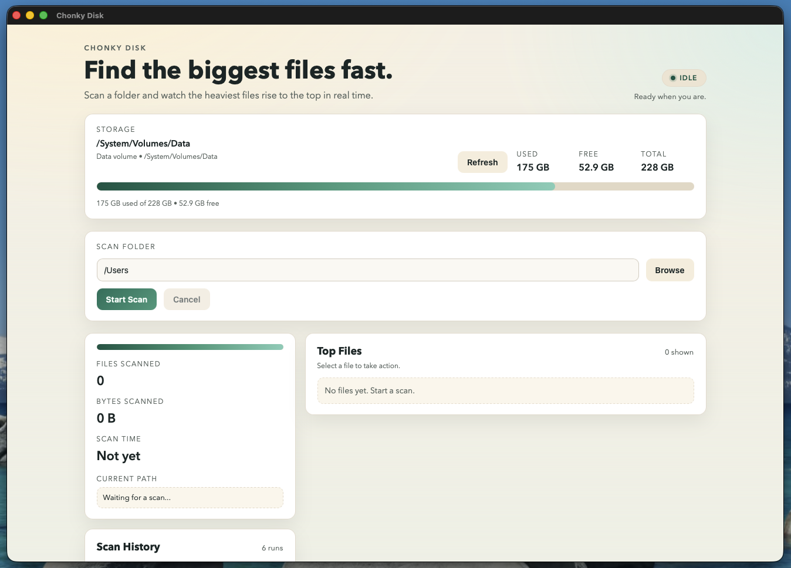

# ChonkyDisk



A lightweight macOS desktop app for scanning disk usage and identifying the largest files on your system.

Built with **Tauri**, **Rust**, and **SolidJS**.

---

## TL;DR

- macOS disk usage scanner
- Streams progress and top 50 largest files in real time
- Rust backend, SolidJS frontend (Tauri IPC via commands + events)
- Includes disk overview, file actions (reveal/open/copy/delete), and post-scan watching
- Built as an experiment in AI-assisted, modern OS-level app development

### Run it locally

```bash
npm install
npm run tauri dev
```

> Requires Node.js and a Rust toolchain (rustc + cargo). See **Build notes** if you hit setup issues.

---

## Why this exists

This project started as an experiment, not because the problem was unsolved.

I wanted to see how quickly I could build a small, OS-level tool using modern primitives and an LLM as a collaborator, and what that process would feel like end to end.

There are already many ways to answer the question “what’s taking up space on my disk.”  
You can do it with terminal commands, with dedicated tools like DaisyDisk, or with macOS’s built-in storage views.

I didn’t build this to replace those.

Part of the motivation was personal. I often prefer a visual interface when I’m trying to understand a filesystem. Being able to reveal files in Finder, move up and down the directory tree, and act on results directly is faster for me than working purely in the terminal.

The other part was exploratory. This project is a way to test how much software can collapse into a focused, purpose-built tool when you combine fast runtimes, good OS primitives, and AI-assisted development.

The result is a small app that does one thing well, and exists primarily as a learning exercise.

---

## High-level architecture

The app is intentionally split into two parts:

- A **Rust backend** responsible for filesystem access, scanning, and safety
- A **SolidJS frontend** responsible for rendering progress and results

Communication happens through **Tauri commands and events**.  
There is no gRPC, no background daemon, and no persistent service.

---

## What it does

### Disk scanning

- Scans a user-selected root path
- Walks directories iteratively and sums file sizes
- Skips symlinks entirely
- Never opens file contents
- Tracks total files scanned and total bytes processed
- Maintains a Top N list of the largest files (default N = 50)

Scanning is performed in Rust and runs off the main thread.

---

### Progress streaming

The scanner emits two event types:

- `scan_progress` for periodic updates
- `scan_complete` when scanning finishes or is canceled

Each event payload includes:

- total files scanned
- total bytes scanned
- current path being processed
- the current Top N largest files list

Updates are throttled to keep the UI responsive.

---

### Canceling scans

A running scan can be canceled at any time.

Cancelation sets an atomic flag that the scan loop checks between directory entries.  
This allows fast, predictable cancellation without killing threads.

---

### Disk overview

For the selected path, the app reports:

- total disk size
- available space
- used space
- percentage used

Implementation details:

- Uses `statvfs` on Unix and macOS
- On macOS, attempts to resolve mount point and volume name using `statfs` and `getattrlist`

---

### Live filesystem watching

After a scan completes, the app starts a filesystem watcher on the scanned root.

- Emits events for file creates, modifies, and removals
- File-only. No symlinks
- Events are throttled via a bounded channel

This keeps the UI reasonably up to date after the initial scan.

---

### File actions

From the UI, users can:

- Reveal a file in Finder
- Open a file
- Copy the full path
- Delete a file

Deletion behavior:

- Confirmation dialog is always shown
- Extra confirmation is required for sensitive paths
- Only regular files can be deleted
- Symlinks are explicitly rejected
- Deletion is performed via a Rust command, not directly from the renderer

---

## Security and safety

The app intentionally keeps a tight security model:

- Tauri allowlist is restricted
- The renderer cannot arbitrarily delete files
- All destructive actions go through validated Rust commands
- Content Security Policy allows only local scripts, styles, and Tauri IPC

Filesystem access is centralized and auditable.

---

## Build notes

This project uses Tauri with a Rust backend and a SolidJS frontend.

You will need:

- Node.js + npm
- Rust toolchain (rustc + cargo)

If you have an older Rust installation, the build may fail with errors related to unsupported compiler versions or missing toolchain components. Updating Rust fixes most of these issues.

Recommended:

```bash
rustup update
rustup toolchain list
rustc --version
cargo --version
```

---

## Troubleshooting

### Cargo or Rust is out of date

Symptoms:

- compile errors in dependencies
- messages about minimum supported Rust version (MSRV)
- build scripts failing unexpectedly

Fix:

```bash
rustup update
cargo clean
npm run tauri dev
```

### Working through build issues with an LLM

This repo was built with help from an LLM, and it is totally in-scope to use your LLM of choice to debug local environment issues.

A good prompt to use:

> I am building a Tauri app with a Rust backend. Here is my terminal error output. Please identify whether this is a Rust MSRV/toolchain issue, a missing system dependency, or a Tauri config issue. Provide the minimal steps to fix it on macOS.

If you open an issue, include:

- your macOS version
- `rustc --version`
- `cargo --version`
- the full error output

---

## Tech stack

- **Tauri**
- **Rust**
- **SolidJS**
- **TypeScript**

---

## Project goals

This is a personal project and an experiment, not a commercial product.

Goals:

- Explore modern desktop app architecture
- Test how effectively an LLM can guide system-level development
- Build a tool that solves a real personal problem
- Keep the codebase small and understandable

Non-goals:

- Feature parity with DaisyDisk
- Fancy visualizations
- Cross-platform polish
- Persistent indexing or background scans

---

## Status

The app is functional and usable today.

It may grow, or it may remain intentionally small.  
That outcome is part of the experiment.
